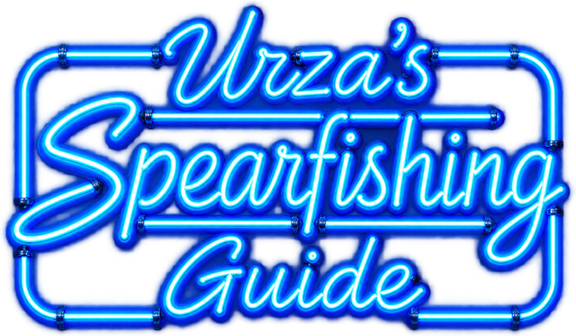
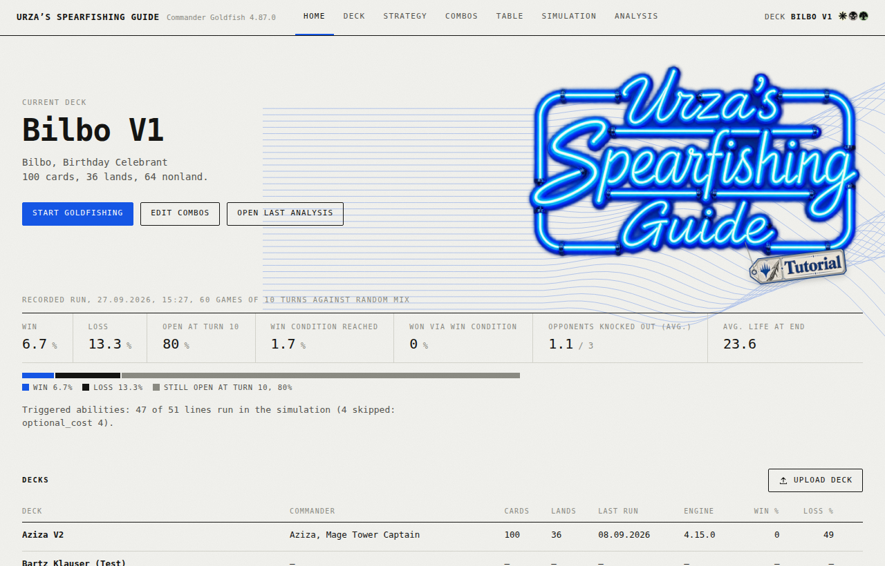
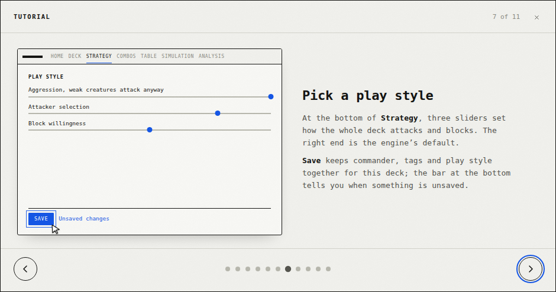
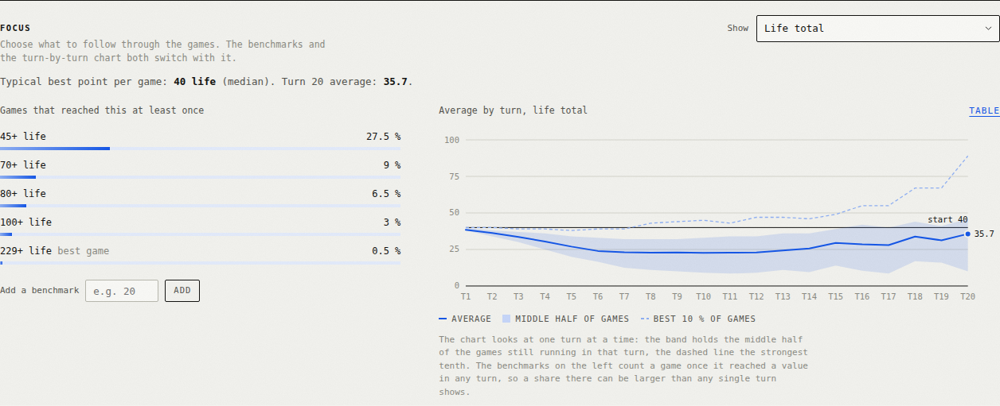

<p align="center">
  
</p>

# Urza's Spearfishing Guide

**Ein lokales Test-Labor für Magic: The Gathering Commander-Decks.**

Du lädst eine Deckliste hoch, sagst dem Programm, wie das Deck gewinnen will,
und lässt es ein paar hundert Partien „goldfishen“ – also allein
durchspielen, gegen einen simulierten Tisch aus drei Gegnern. Danach siehst
du, wie oft deine Win Conditions zustande kommen, wie sich Leben, Board,
Handkarten oder Mana über die Züge entwickeln, woran es hakt, und wie das
Deck im Vergleich zu 1.585 echten EDHREC-Decks derselben Farben aufgestellt
ist.

Alles läuft auf dem eigenen Rechner: eine Python-Engine (`app/App/engine.py`),
ein kleiner Flask-Server und eine Web-Oberfläche im Browser.

> Goldfish-Ergebnisse sind eine Hilfe beim Deckbau, keine Vorhersage echter
> Siegquoten am Tisch. Die Engine ist ein Heuristik-Simulator, kein
> vollständiges Magic-Regelwerk (siehe [Grenzen](#grenzen)).

<p align="center">
  
</p>

---

## Inhalt

1. [Schnellstart](#schnellstart)
2. [Der Arbeitsablauf in acht Schritten](#der-arbeitsablauf-in-acht-schritten)
3. [Die Analyse lesen](#die-analyse-lesen)
4. [Mit KI weiterarbeiten](#mit-ki-weiterarbeiten)
5. [Was bei einem Lauf herauskommt](#was-bei-einem-lauf-herauskommt)
6. [Ordnerstruktur](#ordnerstruktur)
7. [Wie die Engine arbeitet](#wie-die-engine-arbeitet)
8. [Server-Schnittstelle (API)](#server-schnittstelle-api)
9. [Tests](#tests)
10. [Für Entwickler: Konventionen](#für-entwickler-konventionen)
11. [Grenzen](#grenzen)
12. [Datenquellen, Rechte, Lizenzen](#datenquellen-rechte-lizenzen)

---

## Schnellstart

**Voraussetzung:** Python **3.10 oder neuer**
([python.org](https://www.python.org/downloads/); unter Windows beim
Installieren „Add python.exe to PATH“ ankreuzen) und eine Internetverbindung
für Kartendaten und -bilder von Scryfall.

**Windows:** Doppelklick auf `Start_Urzas_Spearfishing_Guide.bat`.

**Alle Systeme:**

```bash
python Start_Urzas_Spearfishing_Guide.py
```

Das Startskript

1. wechselt, falls vorhanden, in die projekteigene Umgebung `.venv/`,
2. prüft die benötigten Pakete (`flask`, `numpy`, `pandas`, `pillow`,
   `requests`) und installiert fehlende über `install_dependencies.py`
   (= `pip install -r requirements.txt` mit genau diesem Python),
3. startet `app/web_server.py` mit `PYTHONHASHSEED=0` – damit liefert
   derselbe Seed bei jedem Programmstart exakt dieselben Zahlen – und öffnet
   den Browser unter <http://127.0.0.1:8765/>.

Optionen werden durchgereicht: `--port 9000` für einen anderen Port,
`--no-browser`, um das automatische Öffnen zu unterdrücken. Beenden:
Konsolenfenster schließen oder `Strg+C`.

Beim ersten Laden eines neuen Decks holt die Engine die Kartendaten von
Scryfall und legt sie im Cache `app/App/.scryfall_card_cache_v4.json` ab;
danach läuft dieses Deck auch ohne Internet.

---

## Der Arbeitsablauf in acht Schritten

Dasselbe erklärt auch das **Tutorial** in der Oberfläche – das kleine
Etikett, das auf der Startseite am Leuchtschild hängt.

<p align="center">
  
</p>

| # | Wo | Was du tust |
|---|----|-------------|
| 1 | **Home → Upload deck** | Liste einfügen oder Datei wählen. Exporte von Moxfield, Archidekt, EDHREC, MTGGoldfish oder eine einfache `.txt`/`.csv` funktionieren. Jede Zeile der Deckliste auf Home ist klickbar und macht das Deck zum aktuellen. |
| 2 | **Strategy → Commander** | Commander ankreuzen (zwei für Partner). Angeboten werden alle legendären Kreaturen und „can be your commander“-Karten der Liste. |
| 3 | **Strategy → Strategie-Tags** | Ein bis drei Tags, die den Plan beschreiben (Lifegain, Tokens, Spellslinger …). Sie steuern das Wertmodell und den Vergleich mit den Referenzdecks. |
| 4 | **Combos** | Win Conditions bauen: Karten aus der Bibliothek auf die Fläche ziehen; eine Schleife um Alternativen zeichnen ergibt eine ODER-Gruppe („2 von diesen 3“). Darunter Schwellen für Leben, Mana, Ressourcen und die Art (Win Condition, Combo …). **Save combo** nicht vergessen. |
| 5 | **Strategy → Play style** | Drei Regler: wie aggressiv das Deck angreift, welche Kreaturen als „zu schwach zum Angreifen“ gelten, wie bereitwillig es blockt. Rechts = Standardverhalten der Engine. **Save** speichert Commander, Tags und Spielstil zusammen. |
| 6 | **Table** | Wie die drei simulierten Gegner ihr Ziel wählen: Rache, gemeinsam auf den Führenden, Rücksicht auf Group-Hug-Decks. Gilt für alle Decks. |
| 7 | **Simulation** | Anzahl Spiele und Züge, Seed, Gegnermischung, Commander-Haltung, welche Win Conditions beobachtet werden. Dann **Start goldfishing** (oder auf die Sardinendose klicken). Der Fisch gleitet im Takt der fertigen Partien aus der Dose. |
| 8 | **Analysis** | Ergebnisse lesen, Fokus-Kennzahl wählen, Win Conditions aufklappen, über **Download** das Fact Sheet (PDF) oder die Simulationsdaten (ZIP) holen. |

Commander, Tags und Spielstil werden pro Deck in `app/Decks/.deck_meta.json`
gespeichert, die Tischpolitik in `app/Data/Models/table_dynamics.json`, die
Combos pro Deck im Browser.

---

## Die Analyse lesen

<p align="center">
  
</p>

**Kopf.** Die große Zahl ist der Anteil der Partien, in denen mindestens eine
der beobachteten Win Conditions vollständig erreicht wurde. Darunter Sieg,
Niederlage, „noch offen“ nach dem letzten Zug, typischer Siegzug, gezogene
Karten und Mulligans. Der Kasten **Simulation coverage** nennt Schlüsselkarten,
deren Effekt die Engine (noch) nicht oder nur teilweise ausführt – dann sind
die Zahlen eher eine Untergrenze.

**Focus.** Ein Auswahlmenü mit 17 Kennzahlen: Lebenspunkte, Lebensgewinn und
erlittener Schaden, Kreaturen, Token, Gesamtstärke, stärkste Kreatur,
+1/+1-Marken, Permanents, Handkarten, gezogene Karten, eigener Friedhof, beim
Gegner gemillte Karten, den Gegnern genommenes Leben, niedrigstes Gegnerleben,
Mana, Länder. Die Wahl steuert beide Hälften:

- **Links – Marken:** „In X % der Partien mindestens einmal erreicht“. Eine
  Partie zählt, sobald sie den Wert **in irgendeinem Zug** berührt hat. Die
  Marken werden aus der Verteilung des Laufs gewählt und enden beim besten
  Einzelspiel; eigene Marken (z. B. 111 Leben für Bilbo) lassen sich
  hinzufügen.
- **Rechts – Verlauf je Zug:** die Linie ist der Durchschnitt, das Band die
  **mittlere Hälfte** der Partien *in diesem Zug* (25 %–75 %), die
  gestrichelte Linie die **besten 10 %** in diesem Zug.

Warum kann links „27 % erreichen 45+ Leben“ stehen, während das Band nie über
40 geht? Weil die beiden etwas Verschiedenes messen. Das Band schaut auf
einen Zug nach dem anderen und blendet oben und unten je ein Viertel aus. Die
Partien, die hoch hinausgehen, tun das in unterschiedlichen Zügen – in jedem
einzelnen Zug sind es weniger als ein Viertel, also liegen sie oberhalb des
Bandes (sichtbar an der gestrichelten Linie). Die Marke links zählt dagegen
jede Partie, die irgendwann einmal über 45 war. Außerdem: Beendete Partien
(gewonnen oder verloren) fallen aus den späteren Zügen heraus; im Tooltip
steht, wie viele Partien in einem Zug noch liefen.

**Win Conditions.** Jede Zeile trägt ihre eigenen Zahlen: „Setup reached“
(alles erfüllt, inklusive Mana), „Cards and thresholds“ (Karten und Schwellen
erfüllt, Mana noch nicht unbedingt), typischer Zug und ein Mini-Verlauf „bis
Zug N erreicht“. Aufklappen zeigt, was in den übrigen Partien noch fehlte.
„Single target“ heißt: die Bedingung prüft nur den schwächsten Gegner, nicht
alle gleichzeitig.

**Weiter unten:** Ausgang je Gegnerprofil, Mana je Zug, automatische Hinweise
(„What stands out“), der Vergleich mit den EDHREC-Referenzdecks,
Karten-Highlights (modellierter Wert pro gesehener Karte) und Kampf-Diagnostik.

---

## Mit KI weiterarbeiten

Das Programm ist darauf ausgelegt, mit einem KI-Chat (Claude, ChatGPT …)
zusammenzuarbeiten:

- **Strategie-Tags:** *Strategy → Copy prompt* kopiert eine fertige Anfrage
  mit Deckliste und den erlaubten Tags. Die Antwort nennt die passenden Tags
  mit Begründung.
- **Win Conditions:** *Combos → Import JSON → Copy prompt* kopiert eine
  Anfrage mit Deck und exaktem Szenario-Format. Die Antwort der KI wieder in
  *Import* einfügen – die Combos werden daraus gebaut (optional mit
  passendem Spielstil).
- **Auswertung:** *Analysis → Download → Simulation data (ZIP)* liefert den
  vollständigen Ergebnisordner des Laufs, inklusive einer
  Arbeitsanweisung für KI (`AI_ANALYSIS_INSTRUCTIONS.md`). Die ZIP zusammen
  mit einer Frage in einen KI-Chat geben – etwa „Warum stockt meine Win
  Condition?“ oder „Welche Karten ziehen nicht mit?“.
- **Zum Ablegen:** *Download → Fact sheet (PDF)* erzeugt ein A4-Dokument mit
  Deckliste, allen Randbedingungen und den Ergebnissen samt Diagrammen.

---

## Was bei einem Lauf herauskommt

Jeder Lauf legt einen Ordner an unter
`app/Goldfish_Results/<Deck>/<Deck>_v4_7_0_<Datum-Uhrzeit>/` (plus eine
gleichnamige ZIP). Die wichtigsten Dateien:

| Datei | Inhalt |
|-------|--------|
| `summary.json` | Alles Zusammengefasste: Ausgänge, Gegnerprofile, Szenarien, Fokus-Kennzahlen (`metrics`), Modell-Lücken. Daraus baut die Oberfläche ihre Analyse. |
| `analysis_overview.json` | Kompakte Übersicht mit Beobachtungen, Kampf- und Removal-Diagnostik. |
| `runs.csv`, `turns.csv`, `analysis_turns.csv`, `turn_aggregates.csv` | Pro Partie bzw. pro Zug: Leben, Mana, Hand, Board, Ereignisse. |
| `scenario_runs.csv`, `combo_scenarios.json` | Win Conditions je Partie: erreicht wann, was fehlte. |
| `card_impact.csv`, `engine_value.csv`, `value_model.json` | Karten-Wertmodell und gemessener Einfluss jeder Karte. |
| `card_model_coverage.csv`, `semantic_runtime_report.csv`, `MODEL_COVERAGE_AND_AI_REVIEW.md` | Welche Kartentexte die Engine wie gut versteht – die Grundlage für ehrliche Lücken-Hinweise. |
| `opening_hands.csv` | Starthände und Mulligans. |
| `AI_ANALYSIS_INSTRUCTIONS.md`, `SCENARIO_SCHEMA.md` | Anleitung für eine KI-Auswertung und das Szenario-Format. |

---

## Ordnerstruktur

```
Commander_Goldfish/                       (Wurzel dieses Repositorys)
├── Start_Urzas_Spearfishing_Guide.py     einziger Startpunkt
├── Start_Urzas_Spearfishing_Guide.bat    Windows-Doppelklick
├── install_dependencies.py               installiert requirements.txt
├── requirements.txt
├── README.md                             diese Datei
└── app/
    ├── web_server.py                     Flask-Server: Oberfläche, API, ruft die Engine
    ├── webui_transform.py                Engine-Ergebnis -> JSON für die Oberfläche
    ├── webui/index.html                  die komplette Oberfläche (eine Datei, Bilder eingebettet)
    ├── App/
    │   ├── engine.py                     die Simulations-Engine
    │   ├── factsheet_pdf.py              PDF-Fact-Sheet (ohne Fremdbibliothek)
    │   ├── fonts/, factsheet_assets/     Schrift (DejaVu Sans Mono) und Leuchtschild fürs PDF
    │   ├── keyword_library/              Aktionen/Schlüsselwörter als Daten + Handler
    │   ├── trigger_bus/                  ausgelöste Fähigkeiten ("Whenever …") generisch
    │   ├── combat_model/                 Angriff, Blocken, Commander-Haltung, Spielstil
    │   ├── opponent_model/               drei kalibrierte Bracket-3-Gegner
    │   ├── archetype_profile/            1.585-Deck-EDHREC-Referenz (Daten in data/)
    │   ├── removal_profile/, synergy_profile/, team_effects/, mana_scaling/,
    │   │   hand_evaluation/, resource_planner/, scenario_predicates/, benchmark/
    │   ├── gui.py                        ältere Tkinter-Oberfläche (optional)
    │   └── .scryfall_card_cache_v4.json  Kartendaten-Cache (wird fortgeschrieben)
    ├── Data/
    │   ├── Models/                       Gewichte und Kalibrierungen (JSON), u. a. table_dynamics.json
    │   ├── Scenarios/                    Beispiel-Szenarien
    │   └── Learned/                      lokal gelerntes Wertgedächtnis (nicht im Repo)
    ├── Decks/                            Decklisten (.txt), Fremd/ = Vergleichsdecks und Precons
    ├── Goldfish_Results/                 Ergebnisse eigener Läufe (nicht im Repo)
    ├── Docs/                             Entwicklungsdoku, Changelog (Docs/README.md), Bilder
    ├── tests/                            automatisierte Tests (unittest)
    ├── reliability_sweep_v1/             Skript für Massentests über viele Decks
    ├── dev_tools/                        Entwickler-Skripte
    └── commander_goldfish.py             Start der alten Tkinter-Oberfläche
```

---

## Wie die Engine arbeitet

**Vom Kartentext zur Aktion.** Beim Laden eines Decks werden die
Oracle-Texte von Scryfall geholt und Zeile für Zeile übersetzt:
`parse_oracle_semantics` trennt aktivierte Fähigkeiten in Kosten (Mana, Tap,
Opfern, Abwerfen, Marken entfernen) und Effekt, `_parse_semantic_actions`
erkennt im Effekt Muster wie „draw“, „gain life“, „create a token“, „gains
double strike until end of turn“ oder „search your library for a card named
…“. Jede Fähigkeit bekommt eine Einstufung (`exact`, `simplified`,
`probabilistic`, `review`); was nur als `review` erkannt wird, landet ehrlich
in der Lücken-Anzeige statt still Wert zu erfinden. Ziel ist immer eine
**generische** Regel, die jede Karte mit demselben Textbaustein abdeckt, nicht
ein Sonderfall pro Karte.

**Ausführen.** Erkannte Aktionen laufen über eine deklarative Registry
(`App/keyword_library/definitions.json` → Handler in `handlers.py`, Dispatcher
in `registry.py`). Eine neue Mechanik braucht einen JSON-Eintrag und einen
Handler, keine Änderung an der Dispatch-Logik. Ausgelöste Fähigkeiten
(„Whenever …“, „At the beginning of …“) laufen über `App/trigger_bus`.

**Eine Partie.** Mulligan-Entscheidung, dann Zug für Zug: Land, Mana
bereitstellen (inklusive Ritualen, Schätzen, Food), Zauber nach Wert und
Szenario-Fokus auswählen, Kampf mit Angriffs- und Blockmodell, danach die
Gegnerphase. Die Gegner sind drei Bracket-3-Sitze mit Strategie (Aggro,
Midrange, Control, Horde oder zufällig) und Farben, die Druck aufbauen,
Removal und Board Wipes spielen und untereinander Ziele wählen
(Tischpolitik). Ein Spiel endet mit Sieg (alle Gegner auf 0), Niederlage oder
nach dem letzten Zug.

**Win Conditions (Szenarien).** Jede Combo aus dem Builder wird zu einem
Szenario: Pflichtkarten mit Zone und Bereitschaft (z. B. „Battlefield, untapped“),
ODER-Pakete mit Mindestanzahl, Mana- und Ressourcenschwellen, optional ein
Effekt beim Erreichen (z. B. „gewinnt das Spiel“ oder „erzeugt unendlich
Token“). Mit **Steuern** richtet die Engine ihre Kartenwahl auf das jeweils
aussichtsreichste Szenario aus; ohne Steuern wird nur beobachtet.

**Aufbau von `engine.py`.** Die Datei ist über viele Versionen gewachsen und
folgt einer festen Regel: Funktionen werden weiter unten neu definiert und
umhüllen die vorige Fassung (`_old = funktion; def funktion(...): ... _old(...)`).
Aktiv ist immer die **letzte** Definition. Neue Verhaltensänderungen werden
als neue Schicht am Dateiende (vor `main_v470`) ergänzt, nicht in alten
Schichten umgebaut. `tests/test_no_dead_top_level_definitions.py` wacht
darüber, dass dabei nichts versehentlich tot wird.

**Kennzahlen.** Pro Zug werden die 17 Fokus-Kennzahlen erfasst
(`FOCUS_METRICS`), zu Mittelwert, 10/25/75/90-%-Punkten je Zug und einem
Histogramm des besten Werts je Partie verdichtet und als `summary["metrics"]`
weitergegeben.

**Reproduzierbarkeit.** Gleiches Deck, gleiche Einstellungen, gleicher Seed
und `PYTHONHASHSEED=0` ergeben exakt dasselbe Ergebnis.

---

## Server-Schnittstelle (API)

Der Server (`app/web_server.py`) lauscht nur lokal auf `127.0.0.1`.

| Methode | Pfad | Zweck |
|---------|------|-------|
| GET | `/api/health` | Lebenszeichen und Engine-Version |
| GET | `/api/decks` | alle Decks mit letztem Lauf |
| GET | `/api/deck/<name>` | Deck mit Karten, Commander, Tags, Spielstil |
| GET | `/api/deck/<name>/last-run` | letzter aufgezeichneter Lauf, im Format der Oberfläche |
| GET | `/api/deck/<name>/curve-reference` | Manakurve der Referenzdecks |
| POST | `/api/decks/upload` | Deckliste hochladen (Datei oder Text) |
| POST | `/api/decks/<name>/rename` | umbenennen |
| DELETE | `/api/decks/<name>` | löschen (Ergebnisse bleiben) |
| POST / DELETE | `/api/decks/<name>/cards[/<karte>]` | Karte hinzufügen / entfernen |
| POST | `/api/decks/<name>/commander` | Commander, Tags, Spielstil speichern |
| GET / POST | `/api/table-politics` | Tischpolitik lesen / speichern |
| POST | `/api/simulate` | Lauf starten (Spiele, Züge, Seed, Gegner, Haltung, Szenarien …) |
| GET | `/api/simulate/<job>` | Fortschritt und Ergebnis |
| POST | `/api/factsheet` | Fact Sheet als PDF |
| GET | `/api/deck/<name>/runs/<ordner>/zip` | Ergebnisordner eines Laufs als ZIP |

---

## Tests

```bash
cd app
python -m unittest discover -s tests -p "test_*.py"
```

Rund 1.240 Tests, Laufzeit wenige Sekunden. Einige Tests laden Decks über den
mitgelieferten Scryfall-Cache; ohne ihn (und ohne Internet) schlagen diese
fehl. Neue Versionen bringen eigene Testdateien mit
(`tests/test_v<version>_<thema>.py`).

---

## Für Entwickler: Konventionen

Diese Regeln haben sich im Projekt bewährt und gelten auch für Arbeit mit
KI-Assistenten:

- **Generisch statt Sonderfall.** Wird eine Karte falsch verstanden, wird
  die Textschablone dahinter behoben, damit alle Karten mit demselben
  Wortlaut profitieren. Beispiele stehen im Changelog.
- **Neue Schicht statt Umbau** in `engine.py` (siehe oben), jede Änderung mit
  Tests.
- **Changelog** auf Deutsch in `app/Docs/README.md`: neuer Eintrag oben, mit
  Ausgangslage, Ursache, Lösung und QA.
- **Lokaler Zustand gehört nicht ins Repo und wird nie überschrieben:**
  `app/Decks/.deck_meta.json` (Commander/Tags/Spielstil je Deck),
  `app/Data/Learned/engine_value_store.json` (gelerntes Wertgedächtnis),
  `app/Goldfish_Results/` (Läufe). Das Programm legt fehlende Dateien selbst an.
- **Keine automatischen Abfragen bei EDHREC.** Die Referenzdaten stammen aus
  einem einmaligen, manuell erstellten Schnappschuss; es gibt und gibt es
  weiterhin kein Scraping.
- **Reproduzierbar testen** mit `PYTHONHASHSEED=0` (das Startskript setzt es).
- `ENGINE_VERSION` in `engine.py` wird nur bei größeren Versionssprüngen
  angehoben; mehrere Tests prüfen den Wert.

---

## Grenzen

- Kein vollständiges Regelwerk: Stack-Interaktionen, Timing, echte
  Gegner-Boards und optimale Züge werden angenähert, nicht exakt gespielt.
- Kartentexte werden über Muster verstanden. Was nicht erkannt wird, erscheint
  als Lücke (Simulation coverage, `card_model_coverage.csv`); bei zentralen
  Karten sind die Siegquoten dann eine Untergrenze.
- Gegner sind abstrakte, kalibrierte Profile, keine echten Decklisten.
- „Setup reached“ bei einer Win Condition heißt: der Zustand war da – nicht,
  dass die Combo gegen Interaktion durchgeht.

---

## Datenquellen, Rechte, Lizenzen

- **Kartendaten und -bilder:** [Scryfall](https://scryfall.com/) (API und
  Bild-Server; Bilder lädt der Browser direkt). Bitte die
  [Scryfall-Richtlinien](https://scryfall.com/docs/api) beachten.
- **Referenzdecks:** aggregierte Durchschnittsprofile aus einem manuellen
  EDHREC-Schnappschuss (`app/App/archetype_profile/data`). Vor einer
  öffentlichen Freigabe des Repositorys bitte prüfen, ob die Weitergabe
  dieser abgeleiteten Daten erlaubt ist.
- **Schrift im PDF:** DejaVu Sans Mono, Bitstream-Vera-Lizenz
  (`app/App/fonts/LICENSE-DejaVu.txt`).
- Magic: The Gathering, Kartennamen, -texte und Symbole sind Eigentum von
  Wizards of the Coast. Dieses Projekt ist ein inoffizielles Fan-Werk und
  steht in keiner Verbindung zu Wizards of the Coast.
- Für den eigenen Code ist noch keine Lizenz festgelegt.
